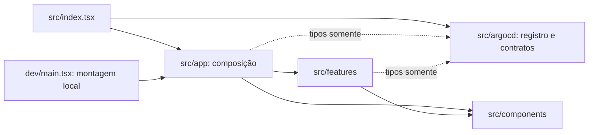
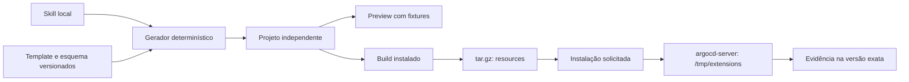

# Índice de arquitetura — Argo CD UI Extension

Arquitetura em camadas por funcionalidades, com adaptador explícito para o host. Documento avulso para uso pessoal. Os ADs abaixo são o contrato resumido; os ADRs associados preservam contexto, alternativas e consequências. IDs AD-n e ADR de mesmo número identificam a mesma decisão e não serão renumerados.

**Adotado** significa herdado do PRD ou contrato upstream. **Proposto [ASSUMPTION]** significa escolha de Winston sob autorização para elaborar suposições, ainda revisável por Rodrigo. Finalização documental não comprova funcionamento do Template.

## Design Paradigm



A UI pode importar apenas tipos do adaptador; acesso em runtime ao host pertence ao registro. Componentes compartilhados não dependem das funcionalidades. A seta significa dependência permitida, não fluxo de dados.

## Invariants & Rules

### AD-1 — UI por funcionalidades e adaptador do host

- **Status:** Proposto [ASSUMPTION].
- **Binds:** FR-1, FR-6, FR-7; UI e integração.
- **Prevents:** Funcionalidades dependentes de globals e contratos de host definidos em vários lugares.
- **Rule:** src/argocd é dono do registro e dos tipos de contexto do host. src/index.tsx conecta esse adaptador a src/app; app compõe features e components. Features não importam o entrypoint nem acessam extensionsAPI. Props do host são somente leitura; estado de interação pertence à UI. Tipos consumidos pela UI têm uma única definição em argocd/types.ts, sem SDK genérico.
- **Registro:** [ADR-0001](adrs/0001-camadas-e-contrato-do-host.md).

### AD-2 — Duas entradas e runtime React do host

- **Status:** Adotado do contrato upstream [ADOPTED].
- **Binds:** FR-6, FR-7; preview e build instalado.
- **Prevents:** React duplicado ou montagem independente dentro do DOM do Argo CD.
- **Rule:** dev/main.tsx monta a UI com dependências locais; src/index.tsx somente registra o componente no host. Produção externaliza react→React, react-dom→ReactDOM e react/jsx-runtime→ReactJSXRuntime conforme o contrato verificado da versão alvo. Outros imports de runtime requerem mapeamento comprovado ou remoção. A configuração de preview não aplica externals de produção.
- **Registro:** [ADR-0002](adrs/0002-duas-entradas-um-runtime.md).

### AD-3 — Template versionado e geração determinística

- **Status:** Proposto [ASSUMPTION].
- **Binds:** FR-2 a FR-5; Template, gerador e Skill.
- **Prevents:** A Skill recria infraestrutura ou gerador e validação interpretam parâmetros diferentes.
- **Rule:** Template e gerador determinístico são versionados juntos. A Skill coleta parâmetros e invoca o gerador; não reescreve build/empacotamento por improvisação. O contrato executável de geração, com esquema, defaults normalizados e tipos, pertence ao gerador e é compartilhado pela validação e pelos consumidores. Ele deve existir antes de implementar Skill e gerador independentemente; mudanças versionam schemaVersion. Fixtures importam os tipos únicos do adaptador do host. Cada projeto contém extension-project.json com schemaVersion, templateVersion, name, description, argoCdVersion, profile e registration; para resource-tab, registration contém group, kind e tabTitle. Destino é argumento da geração, não caminho absoluto persistido. Dados opcionais usam configuração explícita sem segredos. Destino existente interrompe a geração antes de escrever; autorização de alteração exige plano explícito. Atualizações nunca são automáticas.
- **Registro:** [ADR-0003](adrs/0003-template-e-geracao.md).

### AD-4 — Perfil inicial de aba de Application

- **Status:** Proposto [ASSUMPTION].
- **Binds:** A3, FR-3, FR-7; primeiro perfil.
- **Prevents:** Preview usa um contrato enquanto registro instalado usa outro ponto de extensão.
- **Rule:** O primeiro perfil é resource-tab, registrado para group argoproj.io e kind Application. O exemplo neutro mostra contexto recebido, sem funcionalidades de negócio. O adaptador aceita os props documentados application, resource e tree; fixtures seguem os mesmos tipos e tratam ausências. Perfis adicionais exigem adaptador, fixtures e evidência próprios. O pedido pode parametrizar group/kind quando o perfil for validado para outros recursos.
- **Registro:** [ADR-0004](adrs/0004-perfil-inicial.md).

### AD-5 — Bundle único e pacote resources

- **Status:** Proposto [ASSUMPTION].
- **Binds:** FR-9; build, package e instalação.
- **Prevents:** Build gera recursos que o pacote omite ou depende de URLs não disponíveis no host.
- **Rule:** A entrega inicial produz um único extension-<name>.js autocontido quanto aos recursos próprios, com estilos incorporados; módulos do host permanecem externos. Sem chunks dinâmicos ou assets obtidos por URL na base inicial. package gera tar.gz com resources/extension-<name>.js e somente arquivos explicitamente permitidos. Exclui dev, HTML de preview, source maps de desenvolvimento, credenciais e dependências locais. A instalação disponibiliza o conteúdo ao argocd-server sob /tmp/extensions, preservando o prefixo extension. Método e imagem de instalação ficam condicionados ao ambiente escolhido.
- **Registro:** [ADR-0005](adrs/0005-bundle-e-pacote.md).

### AD-6 — Estilos sob contêiner exclusivo

- **Status:** Proposto [ASSUMPTION].
- **Binds:** FR-8; UI e estilos.
- **Prevents:** CSS da extensão muda host ou duas extensões colidem entre si.
- **Rule:** Cada extensão usa contêiner com identificador derivado do nome validado. Todos os seletores e nomes de animação próprios são exclusivos; seletores ficam sob o contêiner. Não aplicar reset global nem alterar body, html ou layout do host. Portais permanecem dentro do contêiner ou usam escopo equivalente verificado. Não introduzir biblioteca visual com CSS global no template mínimo. Layout respeita área disponível e mantém conteúdo excedente acessível por rolagem.
- **Registro:** [ADR-0006](adrs/0006-isolamento-visual.md).

### AD-7 — Compatibilidade por versão exata e evidência

- **Status:** Adotado do PRD [ADOPTED].
- **Binds:** FR-10, FR-11, NFR-1, NFR-2; validação.
- **Prevents:** Build passa e é apresentado como integração ou suporte a versões futuras.
- **Rule:** Fixar Argo CD exato >3.5.1 antes das dependências. Template registra versões e lockfile. Relatório identifica projeto, revisão do código gerado, versão e revisão do template, hash SHA-256 do bundle e pacote efetivamente instalados, alvo, ambiente e cada comando/check com passed, failed ou not-run. Preview e typecheck/build/package não provam integração. Só incluir versão na matriz testada após registro/renderização no host, inspeção do runtime, acesso a conteúdo em painel estreito e amplo com dimensões registradas e tema escuro quando disponível. Falha ou check obrigatório não executado impede conclusão da release inicial. Evidência vale somente para os hashes instalados e a versão exata testada; rebuild não herda validação sem confirmar identidade do artefato. Mudança de conteúdo exige nova validação integrada.
- **Registro:** [ADR-0007](adrs/0007-compatibilidade-e-evidencias.md).

### AD-8 — Toolchain inicial React, TypeScript, Webpack e npm

- **Status:** Proposto [ASSUMPTION].
- **Binds:** FR-2, FR-6, FR-9; infraestrutura do Template.
- **Prevents:** Preview e produção adotam ferramentas incompatíveis e locks diferentes.
- **Rule:** Usar React/TypeScript com Webpack para as duas entradas e npm com package-lock.json. Manter comandos dev, typecheck, lint, test, build e package; typecheck é independente da transpilação. Uma configuração comum e ajustes por ambiente pertencem ao Template. Fixar versões exatas de Node, npm, compilador, bundler, loaders e bibliotecas compatíveis com o host antes do primeiro build; nenhum latest é resolução de release. Preferência posterior de Rodrigo por outro gestor exige substituir gestor e lock juntos.
- **Registro:** [ADR-0008](adrs/0008-toolchain-inicial.md).

### AD-9 — Operação local e backend opcional

- **Status:** Misto: FR-12/NFR-4 adotados; A1/A2/A4 herdadas como [ASSUMPTION].
- **Binds:** A1, A2, A4, FR-12, NFR-3, NFR-4; execução e evolução.
- **Prevents:** Comandos locais publicam ou projetos recebem serviço e atualizações implicitamente.
- **Rule:** Geração, preview, verificações e pacote executam localmente. Push, publicação e deploy têm ações separadas solicitadas por Rodrigo. Sem backend obrigatório, autenticação simulada ou serviço de geração hospedado. Backend futuro requer decisão de fonte de dados, contrato, permissões/proxy e ciclo de entrega separado. Configuração acessível no browser é pública; segredos ficam fora do projeto gerado e do pacote. Argo CD permanece dono de navegação, autenticação e montagem globais.
- **Registro:** [ADR-0009](adrs/0009-operacao-e-evolucao.md).

## Structural Seed

```text
extension-name/
  src/index.tsx
  src/argocd/{register.ts,types.ts}
  src/app/Extension.tsx
  src/features/context/components/
  src/components/             # somente quando compartilhados
  src/styles/
  dev/{main.tsx,index.html,fixtures/}
  scripts/package.mjs
  manifests/                 # método escolhido, quando definido
  extension-project.json
  webpack.config.js
  tsconfig.json
  package.json
  package-lock.json
  README.md
  dist/resources/extension-name.js   # gerado, fora do Git
```

Sem pastas vazias obrigatórias. O código será dono dos detalhes após construção. Gerador e seu esquema ficam junto da versão do Template; sua distribuição exata na Skill pode ser definida sem alterar AD-3.



A instalação é uma etapa separada; o diagrama não autoriza deploy automático. Não há serviço hospedado nem banco de dados próprio. Operação inclui resultado de instalação, renderização e erros do browser; operação do cluster permanece com Rodrigo.

## Deferred

| Decisão | Responsável e momento | Limite enquanto aberta |
| --- | --- | --- |
| Argo CD exato >3.5.1 e cluster de teste | Rodrigo/implementador, antes de dependências | Sem matriz certificada ou dependências escolhidas por latest. |
| Versões exatas da toolchain e runtimes locais | Implementador, após alvo e antes do primeiro build | AD-8 escolhe ferramentas; lockfile e verificação do host fecham versões. |
| Helm, Kustomize ou outro método; imagem/digest do installer | Rodrigo/implementador, antes dos manifestos | AD-5 fixa pacote e diretório; manifests não podem divergir deles. |
| Formato detalhado do esquema de geração | Implementador, antes do gerador | AD-3 fixa campos e proprietário; contrato executável, defaults e tipos fechados antes de consumidores independentes. |
| Distribuição/instalação local da Skill Codex | Implementador, antes de FR-5 | A1 é suposição; recursos precisam funcionar sem conversa original. |
| Domínio, APIs remotas, cache e backend | Rodrigo, no primeiro caso real | Exemplo usa props; qualquer acesso remoto reabre contratos/permissões de AD-9. |
| Chunks, recursos externos e biblioteca visual | Implementador, quando necessários | AD-5/AD-6 valem até substituição com evidência integrada. |
| CI, hospedagem de artefatos e automação de releases | Rodrigo, quando solicitar | Verificações locais são base; nenhum destino ou fornecedor presumido. |
| Baseline e meta de velocidade | Rodrigo, após SM-3 | Correção e compatibilidade permanecem obrigatórias. |

## Fontes

Fontes web consultadas em 2026-10-03. Links de branches e documentação stable são referências de pesquisa, não revisões fixadas para copiar código. Antes de reutilizar código, fixar tag/commit e conferir licença. Nenhum starter, dependência ou imagem foi instalado nesta etapa.

- [PRD](../prd-skill-argocd-ui-extension/prd-skill-argocd-ui-extension.md) e [complemento](../prd-skill-argocd-ui-extension/addendum.md).
- [Padrão pesquisado](../brainstorm-skill-argocd-ui-extension/padrao-projeto.md).
- [Argo CD UI Extensions](https://argo-cd.readthedocs.io/en/stable/developer-guide/extensions/ui-extensions/).
- [Runtime JSX desde Argo CD 3.5](https://argo-cd.readthedocs.io/en/stable/operator-manual/upgrading/ui-extensions-react-19-upgrading/).
- [Rollout: Webpack](https://raw.githubusercontent.com/argoproj-labs/rollout-extension/master/ui/webpack.config.js).
- [Installer: resources e instalação](https://github.com/argoproj-labs/argocd-extension-installer).
- [React: ferramentas e restrições](https://react.dev/learn/build-a-react-app-from-scratch).
